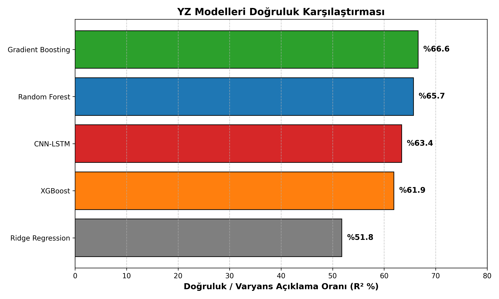
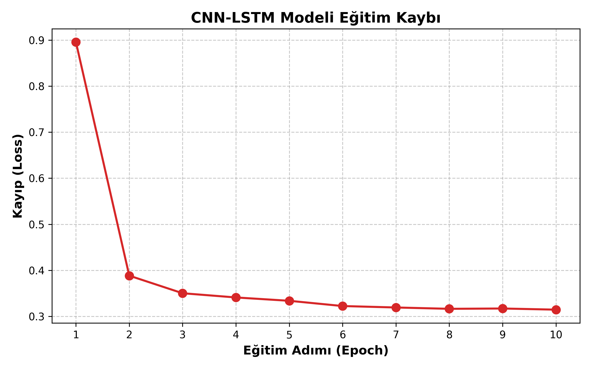

# 🚦 İstanbul Trafik Analiz ve Tahmin Platformu

> İBB Açık Veri Seti (2020–2025) üzerinde derin öğrenme ile trafik analizi, tahmini ve gerçek zamanlı kamera analizi.

<p align="center">
  
  
</p>

---

## 📋 İçindekiler

- [Özellikler](#-özellikler)
- [Mimari](#-mimari)
- [Kurulum](#-kurulum)
- [Kullanım](#-kullanım)
- [Proje Yapısı](#-proje-yapısı)
- [YZ Modelleri](#-yz-modelleri)
- [Veri Seti](#-veri-seti)
- [Katkı](#-katkı)

---

## ✨ Özellikler

| Modül | Açıklama |
|---|---|
| 🗺️ **Yoğunluk Haritası** | İBB verisiyle interaktif trafik haritası (Noktalar / 3D / Isı) |
| 📈 **Zaman Analizi** | Saatlik, haftalık, aylık trafik profilleri ve rush-hour analizi |
| 📊 **Yıl Karşılaştırma** | YoY/MoM karşılaştırması, pandemi etkisi (2020 vs diğer yıllar) |
| 🔮 **YZ Tahmin** | CNN-LSTM, XGBoost, Random Forest, Ridge ile trafik yoğunluk tahmini |
| 🌦️ **Hava Durumu** | Open-Meteo API ile gerçek / tahmini hava durumu entegrasyonu |
| 🗺️ **Rota Optimizasyonu** | OSRM tabanlı çoklu güzergah + yoğunluk/süre tahmini |
| 📹 **Gerçek Zamanlı Analiz** | YOLOv11 ile canlı kamera / video akışı araç sayımı |
| 📍 **İBB Kamera** | İBB Trafik Haritasından HLS yayını yakalama ve analiz |
| 💾 **Veri Yöneticisi** | Parquet dosyaları görüntüleme, CSV append, yedekleme |

---

## 🏗️ Mimari

```
┌─────────────────────────────────────────────────────────┐
│                   Web Dashboard (Streamlit)              │
│  app_web.py  ←→  data_parquet/  ←→  models/            │
│       ↑                                                  │
│  Open-Meteo API  +  OSRM API  +  İBB Açık Veri          │
└─────────────────────────────────────────────────────────┘
┌─────────────────────────────────────────────────────────┐
│             Masaüstü Uygulaması (PyQt6)                  │
│  ui.py  →  video_thread.py  →  analytics.py             │
│       ↓            ↓                                     │
│  YOLOv11       OpenCV / FFmpeg                           │
└─────────────────────────────────────────────────────────┘
```

---

## ⚙️ Kurulum

### Gereksinimler

- Python 3.10+
- (İsteğe bağlı) NVIDIA GPU + CUDA 12.x — YZ eğitimi ve gerçek zamanlı analiz için

### 1. Depoyu Klonla

```bash
git clone https://github.com/KULLANICI_ADI/istanbul-trafik-platformu.git
cd istanbul-trafik-platformu
```

### 2. Sanal Ortam Oluştur ve Bağımlılıkları Yükle

```bash
python -m venv .venv
# Windows:
.venv\Scripts\activate
# Linux / macOS:
source .venv/bin/activate

pip install -r requirements.txt
```

> **Not:** Yalnızca web dashboard kullanacaksanız `PyQt6`, `mss`, `pywin32` ve `yt-dlp` paketlerini atlayabilirsiniz.

### 3. Veri Setini Hazırla

IBB açık verisi (**~6 GB CSV**) şu adresten indirilebilir:
[https://data.ibb.gov.tr/dataset/hourly-traffic-density-data-set](https://data.ibb.gov.tr/dataset/trafik-yogunluk-harita-verisi)

İndirilen CSV dosyalarını `dataset/` klasörüne koyun, ardından:

```bash
# Parquet özetleri üret (birkaç dakika sürer)
python generate_synthetic_data.py
```

### 4. YZ Modellerini Eğit

```bash
python train_models.py
# models/ klasörüne: random_forest.pkl, xgboost.pkl,
#                    gradient_boosting.pkl, lstm_model.pth, scaler.pkl
```

### 5. YOLOv11 Ağırlıkları

YOLO ağırlıkları ilk çalıştırmada `ultralytics` tarafından otomatik indirilir.  
Manuel indirmek için:

```bash
python -c "from ultralytics import YOLO; YOLO('yolo11n.pt')"
```

---

## 🚀 Kullanım

### Web Dashboard

```bash
streamlit run app_web.py
# → http://localhost:8501
```

### Masaüstü Uygulaması (Windows)

```bash
python app.py
```

Masaüstü uygulaması özellikleri:
- Video dosyası / YouTube / RTSP / Ekran / Pencere yakalama
- YOLOv11 ile canlı araç sayımı ve hız tahmini
- Çoklu bölge (polygon) ROI, ısı haritası
- CSV rapor dışa aktarma (İBB veri seti uyumlu)
- İBB Trafik Haritasından HLS kamera yayını yakalama

### Veri Yöneticisi

```bash
python app_data_manager.py
```

---

## 📁 Proje Yapısı

```
istanbul-trafik-platformu/
├── app.py                    # Masaüstü uygulama başlatıcı
├── app_web.py                # Streamlit web dashboard (~3200 satır)
├── app_data_manager.py       # Parquet veri yöneticisi (PyQt6)
├── ui.py                     # Ana pencere ve widget'lar
├── video_thread.py           # YOLOv11 video işleme iş parçacığı
├── analytics.py              # Trafik analiz motoru (hız, yoğunluk, CSV)
├── ibb_map.py                # İBB kamera yayın yakalayıcı (WebEngine)
├── map_picker.py             # Haritadan konum seçme (CARTO + Leaflet)
├── screen_selector.py        # Ekran bölgesi seçici overlay
├── win_utils.py              # Windows pencere yakalama yardımcıları
├── shared_models.py          # CNN-LSTM model tanımı (PyTorch)
├── train_models.py           # Tüm YZ modellerini eğitme scripti
├── generate_synthetic_data.py # Sentetik veri genişletme (DuckDB)
├── istanbul-districts.json   # İstanbul ilçe sınır koordinatları
├── requirements.txt          # Python bağımlılıkları
├── kullanim_rehberi.md       # Detaylı kullanım kılavuzu
├── assets/
│   └── modern_style.css      # Streamlit custom CSS
├── .streamlit/
│   └── config.toml           # Streamlit tema ayarları
├── görseller/                # Grafik ve mimari görseller
├── models/                   # Eğitilmiş modeller (train_models.py ile üretilir)
│   ├── features.json         # Model özellik listesi
│   ├── scaler.pkl            # Özellik ölçekleyici
│   ├── ridge_regression.pkl  # Ridge model
│   ├── lstm_model.pth        # CNN-LSTM PyTorch ağırlıkları
│   └── training_results.json # Eğitim metrikleri
├── data_parquet/             # ← .gitignore (büyük dosyalar)
└── dataset/                  # ← .gitignore (ham İBB CSV'leri ~6 GB)
```

---

## 🤖 YZ Modelleri

| Model | Açıklama | Doğruluk |
|---|---|---|
| **CNN-LSTM** | Zaman serisi öğrenme (PyTorch) | En yüksek |
| **XGBoost** | Gradient boosted trees | Yüksek |
| **Random Forest** | Ensemble karar ağaçları | Yüksek |
| **Gradient Boosting** | scikit-learn GBM | Orta-Yüksek |
| **Ridge Regression** | Temel regresyon (referans) | Orta |

**Girdi özellikleri:** Yıl, ay, saat, haftanın günü, rush hour, mevsim, hava durumu (sıcaklık, yağış), normalizasyon.

**Çıktı:** Araç sayısı tahmini + ortalama hız tahmini + tıkanıklık seviyesi.

---

## 📊 Veri Seti

**Kaynak:** [İBB Açık Veri Portalı](https://data.ibb.gov.tr) — Saatlik Trafik Yoğunluk Verisi  
**Kapsam:** 2020–2025 (yaklaşık 100 milyon satır)  
**Format:** CSV → DuckDB ile Parquet'e dönüştürülür  
**Alanlar:** `date_time`, `lat`, `lon`, `geohash`, `min_speed`, `max_speed`, `avg_speed`, `vehicle_count`, `year`, `month`, `hour`, `day_of_week`

---

## 🤝 Katkı

1. Fork yapın
2. Feature branch oluşturun (`git checkout -b feature/yeni-ozellik`)
3. Değişikliklerinizi commit edin (`git commit -m 'feat: yeni özellik ekle'`)
4. Branch'ı push edin (`git push origin feature/yeni-ozellik`)
5. Pull Request açın

---

## 📄 Lisans

MIT License — ayrıntılar için [LICENSE](LICENSE) dosyasına bakın.

---

<p align="center">
  İBB Açık Veri Seti · YOLOv11 · PyTorch · Streamlit · DuckDB · OSRM
</p>
